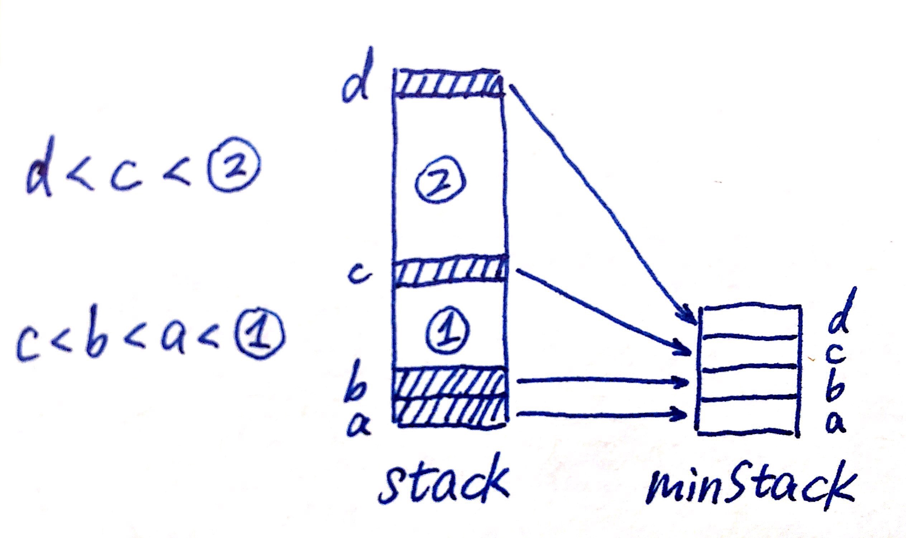
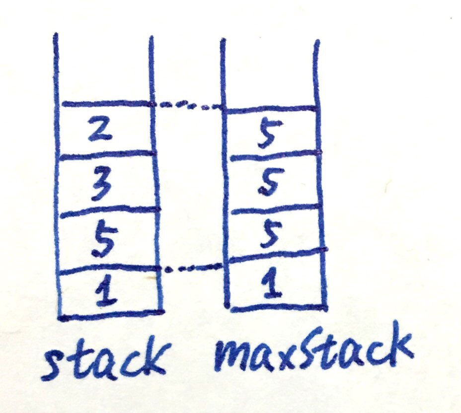
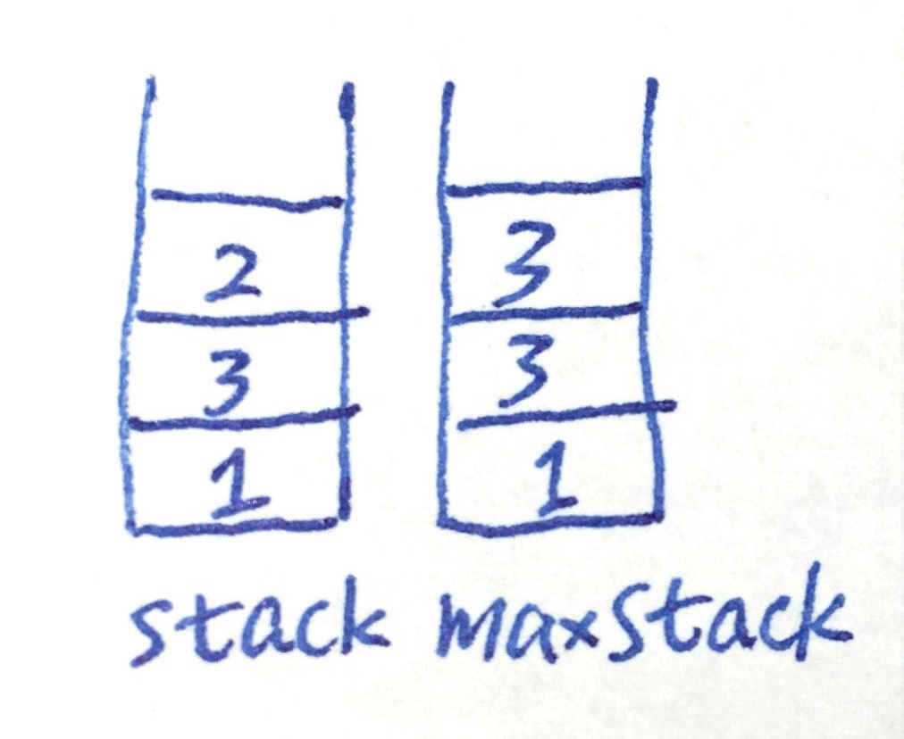
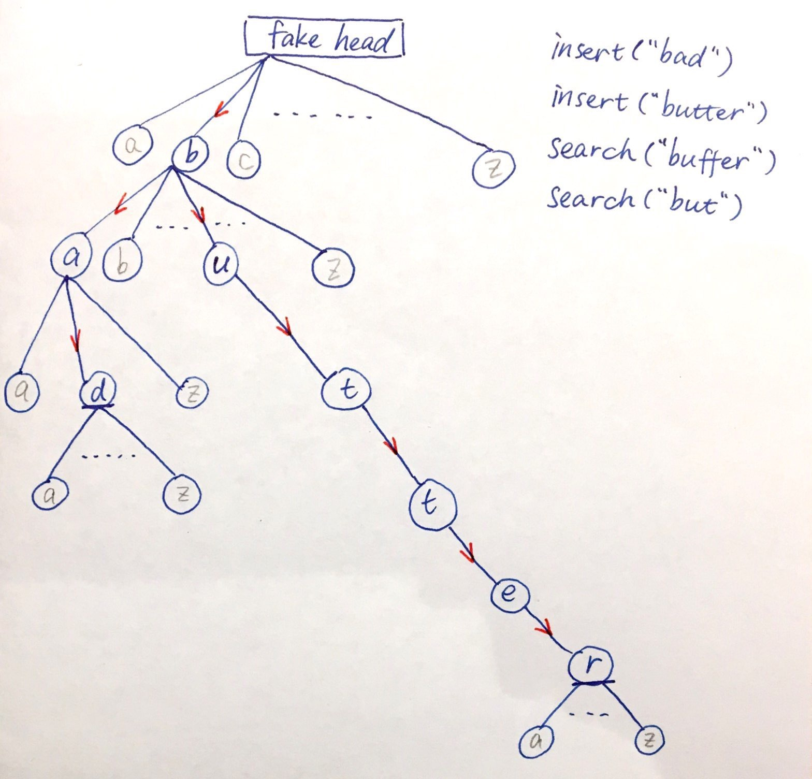

# 380. Insert Delete GetRandom O(1)

基础结构：

1. ArrayList\<Integer\>: 存所有的元素，为了实现random get O(1)
2. HashMap\<Integer, Integer\>: 存\<元素， list中的index>，为了实现查找O(1)

功能实现：

1. insert: 利用map检查是否已存在，没有就加进去 (both map and list)。
2. remove: 利用map检查是否已存在，存在的话从map以及list中移除。但从ArrayList中移除元素会导致所有后面的元素错位，所以要用一个元素来填充空位，并更新那个元素的map映射。这里是用list里的最后一个元素，因为只有这样才不会连锁影响其他元素的位置映射。
3. random: 取一个随机数，从ArrayList里拿到这个元素。

注意：

1. ArrayList中get(index)是O(1)，但LinkedList中get(index)是O(n) in worst case，所以如果用LinkedList那么random就不是O(1)了。
2. 每一个函数都要考虑同步元素及其index的映射。

```java
class RandomizedSet {
    
    Map<Integer, Integer> map;
    List<Integer> list;
    Random rand;

    /** Initialize your data structure here. */
    public RandomizedSet() {
        map = new HashMap<>();
        list = new LinkedList<>();
        rand = new Random();
    }
    
    /** Inserts a value to the set. Returns true if the set did not already contain the specified element. */
    public boolean insert(int val) {
        if(map.containsKey(val)) {
            return false;
        }
        // add to last pos of list, and add to map.
        list.add(val);
        map.put(val, list.size() - 1);
        return true;
    }
    
    /** Removes a value from the set. Returns true if the set contained the specified element. */
    public boolean remove(int val) {
        if(!map.containsKey(val)) {
            return false;
        }
        // if val is last, just remove.
        // if not, swap with the last element in list, and remove.
        if(map.get(val) != list.size() - 1) {
            int lastElement = list.get(list.size() - 1);
            list.set(map.get(val), lastElement); // 这里不能remove再insert，不然就不是O(1)了
            map.put(lastElement, map.get(val));
        }
        list.remove(list.size() - 1);
        map.remove(val);
        return true;
    }
    
    /** Get a random element from the set. */
    public int getRandom() {
        return list.get(rand.nextInt(list.size())); // rand.nextInt(n)是取[0, n-1]这个区间里的随机整数。
    }
}

/**
 * Your RandomizedSet object will be instantiated and called as such:
 * RandomizedSet obj = new RandomizedSet();
 * boolean param_1 = obj.insert(val);
 * boolean param_2 = obj.remove(val);
 * int param_3 = obj.getRandom();
 */
```

# 381.Insert Delete GetRandom O(1) - Duplicates allowed

与上一题不同在于要处理duplicate，即一个数字有多个index。

只要把基础结构里的Map\<Integer, Integer\>扩充为Map\<Integer, Set\<Integer\>\>，用set存所有这个元素的index。

```java
class RandomizedCollection {
    // add a set to the hashMap to remember all the locations of a duplicated number.
    Map<Integer, Set<Integer>> map;
    List<Integer> list;

    /** Initialize your data structure here. */
    public RandomizedCollection() {
        map = new HashMap<>();
        list = new ArrayList<>();
    }
    
    /** Inserts a value to the set. Returns true if the set did not already contain the specified element. */
    public boolean insert(int val) {
        // 即使contain还是要加进去，所以不能一开始如果contain就return fasle
        boolean contain = map.containsKey(val);
        if(!contain) {
            map.put(val, new HashSet<Integer>());
        }
        map.get(val).add(list.size());
        list.add(val);
        return !contain;
    }
    
    /** Removes a value from the set. Returns true if the set contained the specified element. */
    public boolean remove(int val) {
        if(!map.containsKey(val)) {
            return false;
        } else {
            int index = map.get(val).iterator().next(); // 随便取一个index，注意iterator的写法
            map.get(val).remove(index);
            if(index != list.size() - 1) {
                // 用最后一个元素覆盖target元素的位置
                int lastElement = list.get(list.size() - 1);
                list.set(index, lastElement);
                // 更新最后一个元素的位置映射
                map.get(lastElement).remove(list.size() - 1);
                map.get(lastElement).add(index);
            }
            list.remove(list.size() - 1); // 删除最后一个元素，尽管不是target，但没关系，target已经被它取代了
            if(map.get(val).isEmpty()) {
                map.remove(val);
            }
            return true;
        }
    }
    
    /** Get a random element from the set. */
    public int getRandom() {
        Random rand = new Random();
        return list.get(rand.nextInt(list.size()));
    }
}

/**
 * Your RandomizedCollection object will be instantiated and called as such:
 * RandomizedCollection obj = new RandomizedCollection();
 * boolean param_1 = obj.insert(val);
 * boolean param_2 = obj.remove(val);
 * int param_3 = obj.getRandom();
 */
```

# 146. LRU Cache

LRU: Least recent used.

基础结构：LinkedHashMap。其特点是iteration会按照插入顺序进行。

要点：无论get还是put，都要进行remove再重新put以更新位置使之成为recent used元素。

```java
class LRUCache {
    
    private LinkedHashMap<Integer, Integer> _map;
    private int _capacity; // 题目要求中的cache容量

    public LRUCache(int capacity) {
        _map = new LinkedHashMap<>();
        _capacity = capacity;
    }
    
    public int get(int key) {
        if(!_map.containsKey(key)) {
            return -1;
        }
        int val = _map.get(key);
        _map.remove(key); // 要remove再放，不然不会更新位置。
        _map.put(key, val);
        return val;
    }
    
    public void put(int key, int value) {
        if(_map.containsKey(key)) {
            _map.remove(key); // 要remove再放，不然不会更新位置。
        }
        _map.put(key, value);
        if(_map.size() > _capacity) {
            Iterator<Map.Entry<Integer, Integer>> iter = _map.entrySet().iterator(); // 注意iterator的写法
            iter.next();
            iter.remove(); // remove the earliest inserted element
        }
    }
}
```

# 170. Two Sum III - Data structure design

基础结构：HashMap\<Number, Count of Number\>

功能实现：和Two Sum一样的思路，到hashmap里去找target - current value. 为了处理duplicate的情况，不能用hashset而是用hashmap记下每个number一共有几个。

```java
class TwoSum {
    
    Map<Integer, Integer> map;

    /** Initialize your data structure here. */
    public TwoSum() {
        map = new HashMap<>();
    }
    
    /** Add the number to an internal data structure.. */
    public void add(int number) {
        map.put(number, map.getOrDefault(number, 0) + 1);
    }
    
    /** Find if there exists any pair of numbers which sum is equal to the value. */
    public boolean find(int value) {
        for(Map.Entry<Integer, Integer> entry : map.entrySet()) { // 这个entry的key就是第一个加数
            int remain = value - entry.getKey();
            // 两种情况：
            if((remain != entry.getKey() && map.containsKey(remain)) // remain和已有的加数一样，那么看我是否有至少两个这个元素可以凑一对
               || (remain == entry.getKey() && map.get(remain) >= 2)) { // 不一样，那么就去找remain，存在就能凑一对
                return true;
            }
        }
        return false;
    }
}

/**
 * Your TwoSum object will be instantiated and called as such:
 * TwoSum obj = new TwoSum();
 * obj.add(number);
 * boolean param_2 = obj.find(value);
 */
```

# 155. Min Stack

基础结构：两个stack，一个当普通stack使用，另一个只push目前最小的元素，保持栈顶始终是目前最小元素。

功能实现：

1. push：无论如何都要放进普通stack。和minStack.peek()比较，如果新元素更小，就放进minStack，如果一样大，也要放进去（保证出现duplicate时，就算其中一个被pop出去了也不会丢失最小值，举例：push 2，push 1，push 1，pop 1，此时最小还是1，需要仍然有1在minStack顶）。
2. pop：无论如何都要从普通stack pop。要不要从minStack pop要看top是不是目前最小值，不是的话minStack不需要处理，是的话从minStack中pop栈顶。
3. top：直接peek普通stack。
4. getMin：由于我们保证minStack栈顶始终是目前存在元素的最小值，只要peek minStack即可。

注意：不需要担心有些元素并没有放进minStack：



阴影元素为最小值出现为止，即每个最小值都<=下方所有元素。d被pop出去之后，c是留下所有元素中的最小值，对section 2的pop, top操作不对stack和minStack中的d产生影响，当getMin时，c还在minStack栈顶，所以被正确返回。

```java
class MinStack {

    Stack<Integer> stack;
    Stack<Integer> minStack;
    
    /** initialize your data structure here. */
    public MinStack() {
        stack = new Stack<Integer>();
        minStack = new Stack<Integer>();
    }
    
    public void push(int x) {
        stack.push(x);
        if(minStack.isEmpty() || x <= minStack.peek()){
            minStack.push(x);
        }
    }
    public void pop() {
        int top = stack.pop();
        if(!minStack.isEmpty() && minStack.peek() == top) {
            minStack.pop();
        }
    }
    
    public int top() {
        return stack.peek();
    }
    
    public int getMin() {
        return minStack.peek();
    }
}
```

# 716. Max Stack

基础结构：类似min stack，用两个stack。和Min Stack一题不同在于这里不仅要返回max，还要移除max，所以实现逻辑不太一样：



stack和maxStack等高，maxStack高h的位置上存放的是stack高h及以下的最大值。

功能实现：

1. push：把input放进stack，选择input和current max之中的最大值放进maxStack。（可能在maxStack里发生重复，但没关系）

2. pop：对stack进行pop，同时pop maxStack等高的栈顶元素。

3. top：stack.peek().

4. peekMax：因为我们保证maxStack的栈顶是目前的最大值，所以只需maxStack.peek().

5. popMax：重点在此：观察图中例子可知，我们需要让状态变成

   

相当于把max(currently is 5)及以上元素全部pop出去，再依照我们写好的push逻辑把max上层元素再push回去。

```java
class MaxStack {
    
    Stack<Integer> stack;
    Stack<Integer> maxStack;

    /** initialize your data structure here. */
    public MaxStack() {
        stack = new Stack<>();
        maxStack = new Stack<>();
    }
    
    public void push(int x) {
        stack.push(x);
        maxStack.push(maxStack.isEmpty()? x : (maxStack.peek() > x ? maxStack.peek() : x)); // 选择input和max之间的最大值放进maxStack
    }
    
    public int pop() {
        maxStack.pop();
        return stack.pop();
    }
    
    public int top() {
        return stack.peek();
    }
    
    public int peekMax() {
        return maxStack.peek();
    }
    
    public int popMax() {
        
        Stack<Integer> temp = new Stack<>();
        int max = maxStack.peek();
        while(stack.peek() < max) {
            temp.push(pop()); // 1
        }
        pop(); // 2 注意这两个地方是pop()，不是stack.pop()，要使用我们override的方法
        while(!temp.isEmpty()) {
            push(temp.pop()); // 这里也是我们override的push
        }
        return max;
    }
}

/**
 * Your MaxStack object will be instantiated and called as such:
 * MaxStack obj = new MaxStack();
 * obj.push(x);
 * int param_2 = obj.pop();
 * int param_3 = obj.top();
 * int param_4 = obj.peekMax();
 * int param_5 = obj.popMax();
 */
```

# 225. Implement Stack using Queues

基础结构：题目要求用queue

功能实现：第一种是用两个queue倒来倒去，第二种是用一个queue反复翻转。

1. 用两个queue：把一个queue里所有元素都poll出来放进另一个queue，实现取到queue的尾元素（栈顶）的功能。这个步骤可以放在push()也可以放在pop()，放在哪哪个方法的时间复杂度就是O(n)，不包含倒腾的另一个方法时间就是O(1)。
2. 用一个queue：pop的时候把queue翻转（就是不停把头元素poll出来再offer进尾巴）以取到原先的尾元素（栈顶）。这个翻转必须在push()里面实现，如果放在pop里面，移除元素之后

```java
/* Implemented with 2 queues */
class MyStack {
    
    Queue<Integer> queue1;
    Queue<Integer> queue2;

    /** Initialize your data structure here. */
    public MyStack() {
        queue1 = new LinkedList<>();
        queue2 = new LinkedList<>();
    }
    
    /** Push element x onto stack. */
    public void push(int x) {
        queue2.offer(x);
        // 颠倒queue1元素顺序
        while(!queue1.isEmpty()) {
            queue2.offer(queue1.poll());
        }
        queue1 = queue2; // 始终保持queue1是主要的queue
        queue2 = new LinkedList<>();
    }
    
    /** Removes the element on top of the stack and returns that element. */
    public int pop() {
        return queue1.poll();
    }
    
    /** Get the top element. */
    public int top() {
        return queue1.peek();
    }
    
    /** Returns whether the stack is empty. */
    public boolean empty() {
        return queue1.isEmpty();
    }
}

/* implemented with one queue */
class MyStack {
    
    Queue<Integer> queue;

    /** Initialize your data structure here. */
    public MyStack() {
        queue = new LinkedList<>();
    }
    
    /** Push element x onto stack. */
    public void push(int x) {
        int size = queue.size();
        queue.offer(x);
        // 把x换到head
        for(int i = 0; i < size; i++) {
            queue.offer(queue.poll());
        }
    }
    
    /** Removes the element on top of the stack and returns that element. */
    public int pop() {
        return queue.poll();
    }
    
    /** Get the top element. */
    public int top() {
        return queue.peek();
    }
    
    /** Returns whether the stack is empty. */
    public boolean empty() {
        return queue.isEmpty();
    }
}

/**
 * Your MyStack object will be instantiated and called as such:
 * MyStack obj = new MyStack();
 * obj.push(x);
 * int param_2 = obj.pop();
 * int param_3 = obj.top();
 * boolean param_4 = obj.empty();
 */
```

# 232. Implement Queue using Stacks

基础结构：题目要求用stack

功能实现：要用两个stack。stack先进后出的特性使得我们无法通过一个loop来颠倒它。所以两个

```java
class MyQueue {
    
    Stack<Integer> stack1;
    Stack<Integer> stack2;

    /** Initialize your data structure here. */
    public MyQueue() {
        stack1 = new Stack<>();
        stack2 = new Stack<>();
    }
    
    /** Push element x to the back of queue. */
    public void push(int x) {
        while(!stack1.isEmpty()) {
            stack2.push(stack1.pop());
        }
        stack1.push(x);
        while(!stack2.isEmpty()) {
            stack1.push(stack2.pop());
        }
        
    }
    
    /** Removes the element from in front of queue and returns that element. */
    public int pop() {
        return stack1.pop();
    }
    
    /** Get the front element. */
    public int peek() {
        return stack1.peek();
    }
    
    /** Returns whether the queue is empty. */
    public boolean empty() {
        return stack1.isEmpty();
    }
}

/**
 * Your MyQueue object will be instantiated and called as such:
 * MyQueue obj = new MyQueue();
 * obj.push(x);
 * int param_2 = obj.pop();
 * int param_3 = obj.peek();
 * boolean param_4 = obj.empty();
 */
```

# 295. Find Median from Data Stream

基础结构：两个PriorityQueue，一个小顶堆和一个大顶堆。保持大顶堆和小顶堆一样size，或者大顶堆比小顶堆多一个元素。

功能实现：根据Rocky的方法：

1. addNum：无脑加入大顶堆，再从大顶堆取堆顶放入小顶堆。这相当于大顶堆size没变，小顶堆多了一个元素。这时有两种情况：两个堆一样多（状态正确），小比大多一个元素（从小的取一个给大的，这样大的比小的多一个，状态正确）。
2. findMedian：两个堆一样多（取两个堆顶取平均值），大比小多一个（取大堆顶）。

注意：

个人意见是这种题目都要设定好一个不变量，类似loop invariant，每次操作之后都要保证这个状态是成立的。比如min stack的不变状态是minStack的栈顶元素是目前所有现存元素中最小值；max stack中maxStack的栈顶元素是现存元素中最大值；Implement stack with queue中queue或queue1的元素顺序是新元素在头，老元素在尾，；Implement queue with stack里stack1里的元素顺序是老元素在栈顶，新元素在栈底；Find Median from Data Stream里是大顶堆和小顶堆一样size，或者大顶堆比小顶堆多一个元素。

如此一般，存操作实现时保证这个状态的不变，取操作就可以以此为前提进行可靠操作。

```java
public class MedianFinder {
    
    PriorityQueue<Integer> large;
    PriorityQueue<Integer> small;

    /** initialize your data structure here. */
    public MedianFinder() {
        large = new PriorityQueue();
        small = new PriorityQueue(Collections.reverseOrder());
    }
    
    public void addNum(int num) {
        large.offer(num);
        small.offer(large.poll());
        if(large.size() < small.size()) {
            large.offer(small.poll());
        }
    }
    
    public double findMedian() {
        if(large.size() == small.size()) {
            return (large.peek() + small.peek()) / 2.0;
        } else {
            return large.peek();
        }
    }
}

/**
 * Your MedianFinder object will be instantiated and called as such:
 * MedianFinder obj = new MedianFinder();
 * obj.addNum(num);
 * double param_2 = obj.findMedian();
 */
```

# 208. Implement Trie (Prefix Tree)

基础结构：Trie

功能实现：

Trie是字典树，每个node都有26个children(a~z)。注意这个26个字母在一开始只是26个空位置（表现为Character[26]，里面是26个null），往Trie里添加word时才会被初始化（把abcd放进array里）。

当要添加一个word或者查找一个word时，就从第一个字母开始顺着走下去，每个字母对应Trie的一层。添加word时，children里有下一个字母就走过去，没有的话(null)就初始化然后走过去。这样一直把word里的每一个字母都放好。查找word时，也一样顺着往下走，没有找到next letter这个孩子时就结束了。找到word最后一个字母发现全都有时，还要检查是否真的有word在此结束：题目要求完全匹配（word.lastLetter必须是被标明tail的节点），或是prefix形式也可以（last letter不一定是被标明tail的节点）。

看图，铅笔是暂时不存在的孩子节点，蓝色是已经生成的节点。insert了两个单词(bad, butter)之后，我们有了部分重叠的两条边，并且在第三层的'd'和第六层的'r'标记了tail，说明我已有的单词里有在这里结尾的。搜索buffer这个单词时，在第二层的'u'处找不到'f'这个孩子，中断了，说明buffer不存在。搜索but这个词时，虽然but三个字母都按顺序存在，但第三层的t并非标记为tail，这种情况看题意来确认是否搜索成功。



```java
class TrieNode {
    boolean isTail;
    TrieNode[] children;
    public TrieNode(){
        isTail = false;
        children = new TrieNode[26]; // 这个时候children里只是有26个空，并没有abcd在里面
    }
}
public class Trie {
    
    private TrieNode root;

    /** Initialize your data structure here. */
    public Trie() {
        root = new TrieNode(); // fake head
    }
    
    /** Inserts a word into the trie. */
    public void insert(String word) {
        TrieNode nodeNow = root;
        for(int i = 0; i < word.length(); i++) {
            char c = word.charAt(i);
            if(nodeNow.children[c - 'a'] == null) {
                nodeNow.children[c - 'a'] = new TrieNode(); // 以前没生过这个孩子就现在生
            }
            nodeNow = nodeNow.children[c - 'a']; // 往下走一层
        }
        nodeNow.isTail = true; // 标记word结尾
    }
    
    /** Returns if the word is in the trie. */
    public boolean search(String word) {
        TrieNode nodeNow = root;
        for(int i = 0; i < word.length(); i++) {
            char c = word.charAt(i);
            if(nodeNow.children[c - 'a'] == null) {
                return false; // 没这个孩子，搜索失败
            }
            nodeNow = nodeNow.children[c - 'a']; // 往下走一层
        }
        return nodeNow.isTail; // 最后要检查是否标记了结尾
    }
    
    /** Returns if there is any word in the trie that starts with the given prefix. */
    public boolean startsWith(String prefix) {
        TrieNode nodeNow = root;
        for(int i = 0; i < prefix.length(); i++) {
            char c = prefix.charAt(i);
            if(nodeNow.children[c - 'a'] == null) {
                return false;
            }
            nodeNow = nodeNow.children[c - 'a'];
        }
        return true; // 和search的唯一区别就是看不看tail的标记
    }
}

/**
 * Your Trie object will be instantiated and called as such:
 * Trie obj = new Trie();
 * obj.insert(word);
 * boolean param_2 = obj.search(word);
 * boolean param_3 = obj.startsWith(prefix);
 */
```

# 211. Add and Search Word - Data structure design

基础结构：Trie

功能实现：和上题的不同在于出现了'.'这个通配符。遇到通配符时只要搜索所有的孩子就可以了。为了方便重复调用，写成recursion形式。

```java
class WordDictionary {
    
    // build TreeNode class
    private class TrieNode {
        boolean isTail;
        TrieNode[] children;
        //constructor
        public TrieNode() {
            isTail = false;
            children = new TrieNode[26];
        }
    }

    /** Initialize your data structure here. */
    TrieNode root;
    //constructor
    public WordDictionary() {
        root = new TrieNode(); // fake head
    }
    
    /** Adds a word into the data structure. */ // iteration
    public void addWord(String word) {
        TrieNode cur = root;
        for(int i = 0; i < word.length(); i++) {
            char c = word.charAt(i);
            if(cur.children[c - 'a'] == null) {
                cur.children[c - 'a'] = new TrieNode();
            }
            cur = cur.children[c - 'a'];
        }
        cur.isTail = true; 
    }
    
    /* Returns if the word is in the data structure. A word could contain the 
    dot character '.' to represent any one letter. */
    public boolean search(String word) {
        return match(word, 0, root);
    }
    
    private boolean match(String word, int start, TrieNode cur) { // recursion，在cur的孩子里找charAt(start)
        // not found
        if(cur == null) {
            return false;
        }
        // 全部匹配完了
        if(start == word.length()) {
            return cur.isTail;
        }
        // 找下一个letter
        char c = word.charAt(start);
        if(c == '.') { // if is a '.' search every child
            for(TrieNode node : cur.children) {
                if(match(word, start + 1, node)) {
                    return true;
                }
            }
        } else {
            return match(word, start + 1, cur.children[c - 'a']); // if not '.' search next char.
        }
        return false;
    }
}

/**
 * Your WordDictionary object will be instantiated and called as such:
 * WordDictionary obj = new WordDictionary();
 * obj.addWord(word);
 * boolean param_2 = obj.search(word);
 */
```

