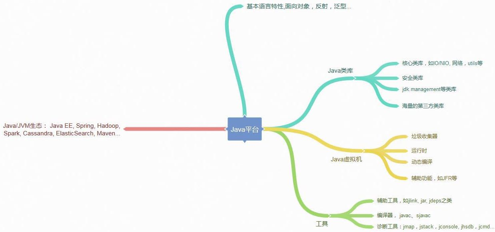
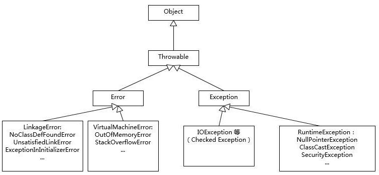
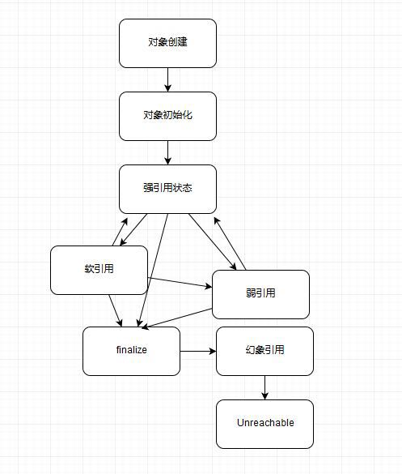

# 第一讲 对Java平台的理解

Java是一种面向对象的编程语言，他有两个显著特性：

1. Write once, run anywhere， 跨平台。
2. Garbage Collection，通过GC回收分配内存，一般不需要程序员自己操心。

JRE(Java Runtime Environment) 是Java的运行环境，包含了JVM和一些类库，以及一些模块等。而JDK(Java Development Kit) 可以看作是JRE的一个超集，提供了更多工具，比如编译器，各种诊断工具。我们写的Java源码，首先通过Javac编译成为字节码(bytecode)，之后在运行时通过JVM内嵌的解释器讲bytecode转化为最终的机器码。正是通过bytecode和JVM这种跨平台的抽象，屏蔽了操作系统和硬件的细节，实现一次编写，到处运行。其实说白了是对于各种平台比如Windows和Linux都有对应的JDK，安装好了也就有让Java运行的环境了。.class文件是可以到处执行的；用JVM对bytecode进行第二次编译，转化成高性能的本地机器码。

**面试中要谈谈对Java平台的理解**：

1. 可以说说Java语言特性，包括范型，Lambda等语言特性，基础类库（集合，IO/NIO，网络，并发，安全...）
2. 可以说JVM的一些基础概念和机制，比如Java的类加载机制；Class-Loader（Bootstrap, Application, Extension Class-Loader...），类加载过程（加载、验证、链接、初始化）
3. 垃圾收集基本原理，常见垃圾收集器（Serial GC, Parallel GC, CMS, G1...）适用什么工作负载
4. JDK包含的工具以及Java的其他工具（编译器、运行环境、安全工具、监控、诊断工具...）



我们一般把Java分为编译期和运行时。编译期生成.class文件，里面是bytecode。运行时，JVM通过Class-Loader加载字节码，解释或者编译执行。主流Java版本中（如JDK8），实际是解释和编译混合的模式（-Xmixed）。通常运行server模式的JVM，会进行上万次调用以收集足够的信息进行高效的编译，client模式这个门限是1500次。Oracle Hotspot JVM内置了两个不同的JIT compiler，C1对应client模式，适用于对启动速度敏感的应用，比如Java桌面应用。C2对应server模式，他的优化是为了长时间运行的服务器端应用设计的。JVM启动时，可以指定不同的参数对运行模式进行选择。

JVM作为一个强大的平台，不仅Java语言可以运行在上面，本质上合规的bytecode都可以，比如Scala, Groovy, JRuby, Jython, Clojure等JVM语言。


# 第二讲 Exception和Error有什么区别

Exception和Error都继承了Throwable类，在Java中只有继承了Throwable类的实例才能被抛出(throw)或捕获(catch)。Exeption是程序正常运行中可以预料的意外情况，可能并且应该被捕获，进行相应的处理。Error是正常情况下不太可能发生的情况，绝大多数Error都会导致程序处于非正常的，不可恢复的状态。既然是非正常情况，所以不便于也不需要被捕获。

Exeption又分为可检查(checked)和不检查(unchecked)异常。可检查异常在源代码中必须显式地进行捕获处理，这是编译期检查的一部分。不检查异常也就是运行时异常，比如NullPointerExeption，通常是可以编码避免的逻辑错误，可根据需要来判断是否需要捕获，不会在编译期强制要求。

Throwable、Exception、Error的设计和分类：



**要准备的问题**：

* 你了解哪些Error, Exception或者Runtime Exception？
* NoClassDefFoundError和ClassNotFoundException有什么区别？
* 掌握应用最为广泛的子类
* 知道如何自定义异常
* try-catch-finally块语法
* throw、throws关键字
* ...

**异常处理的几个常见原则**：

1. 尽量不要捕获类似Exception这种通用异常，而应该捕获特定异常。这样代码可读性也更高。
2. 不要生吞（swallow）异常。千万不要觉得忽略异常也无所谓。如果我们不把异常抛出或者Log出来，程序可能在后续以不可控的方式结束，难以排查问题。
3. try-catch块会产生额外的性能开销，或者说会影响JVM对代码进行优化，所以尽量只捕获有必要的代码段，不要用一个大的try包住整段的代码。同时，使用异常控制代码流程不是个好主意，远比普通的if/else、switch等条件语句要低效。Java每实例化一个Exception，都要对当前的Stack进行快照，如果发生的非常频繁，这个开销就不能被忽略了。

`try {...} `

`catch(IOException e) {`

​	`e.printStackTrace();`

`}`

这段代码作为实验代码是没问题的。但是printStackTrace()是打印到standard error stream，而在生产环境中STERR不是个合适的输出选项，因为你很难判断到底输出到哪了。一般要输出到产品日志里去。


# 第三讲 final, finally, finalize 

1. final修饰类、方法、变量分别有不同的意义：修饰类代表不可继承，修饰的变量代表不可修改，修饰的方法代表不可重写(Override)。用final来表示代码的语义和逻辑意图是很好的实践：

* Java核心类库的定义源码中，java.lang下面的很多类都被标记为final class，在一些第三方类库的基础类中也是如此，这有效避免了API使用者更改其基础功能，某种程度上，这是保证平台安全的必要手段。

* final修饰参数或变量，可以清楚的避免意外赋值带来的错误，产生了某种immutable的效果，保护只读数据。但是**final不是immutable**！看下面例子：

  ```java
  final List strList = new ArrayList<>();
  strList.add("Hello");
  strList.add("world");
  List unmodifiableStrList = List.of("Hello", "world");
  unmodifiableStrList.add("again"); // exception
  ```

  final只能约束strList这个引用不可以被赋值，但strList的对象行为则不受其影响，add( )等操作是完全正常的。如果我们真的希望对象本身不变，那么需要相应的类支持不可变行为，上例中List.of( ) 方法创建的本身就是不可变List，最后的add( ) 会抛出异常。

  immutable在很多场景是非常棒的选择，某种意义上说，Java语言目前并没有原生的不可变支持，如果需要实现immutable的类，我们需要做到：

  - 将class自身声明为final
  - 将所有成员变量声明为private和final，并不要实现setter方法。
  - 通常构造对象时，成员变量通过深度拷贝来进行初始化，而不是直接赋值。这是一种防御措施，因为你无法确定输入对象不被别人修改。
  - 如果需要实现getter方法，或者其他可能会返回内部状态的方法，使用copy-on-write原则，创建私有的copy。

* final也许会有性能的好处，但这和JVM的实现相关，未经验证很难把握，日常开发中最好不要指望这种小技巧带来的性能提升。

2. finally用来保证重点代码一定要被执行，通常包含在try-finally、try-catch-finally块中，用来进行关闭JDBC连接，保证unlock锁等动作。

   一个finally里内容并没有被执行的特例：

   `try{`

   ​	`// do sth`

   ​	`System.exit(1);`

   `} finally {...}` 

   其他finally不被执行的例子还有try中无限循环，或者try-finally线程被杀死。

3. finalize是基础类java.lang.Object的一个方法，它的设计目的是保证对象在被垃圾回收之前完成特定的资源回收。因为无法保证其何时会被执行、执行是否符合预期，现在已不推荐使用，在JDK9开始被标记为deprecated。Java现在在用java.lang.ref.Cleaner来替换掉所有finalize实现。如果要进行资源回收可以考虑try-with-resource或者try-finally机制。我们推荐资源用完即显式释放，或者利用资源池来尽量重用。

   

# 第四讲 强引用、软引用、弱引用、幻象引用

在Java中，除了primitive data type，其他变量都是应用类型，指向各种不同的对象。不同的引用差别主要体现在对象的可达性状态reachable state和对垃圾回收的影响。

1. 强引用（Strong reference）就是常见的普通对象引用。只要还有强引用指向一个对象，就说明它还活着，不会被垃圾收集。如果一个普通的对象没有其他的引用关系，只要超过了引用的作用域或者显式地将强引用赋值为null，该对象就可以背垃圾收集了。
2. 软引用（Soft reference）是相对强引用弱一些的引用，可以让对象豁免一些垃圾收集，只有JVM认为内存不够用时，才会去试图收集软引用指向的对象。JVM会确保在抛出OutOfMemoryError之前清理软引用指向的对象。软引用通常用来实现内存敏感的缓存，如果还有空闲内存，就可以暂时保留缓存，内存不足时清理掉。这就保证了使用缓存的同时不会耗尽内存。
3. 弱引用（Weak reference）并不能使对象豁免垃圾收集，仅是提供一种访问在弱引用状态下对象的途径。这就可以用来构建一种没有特定约束的关系，比如维护一种非强制性的映射关系，如果试图获取对象时还存在，就使用它，否则重新实例化，它同样是很多缓存实现的选择。
4. 幻象引用，也叫虚引用，你不能通过它访问对象。幻象引用仅仅提供了一种确保对象在finalize之后，做某些事情的机制。比如上文中的清理机制。
5. 其实我们在平时的开发中，很少会直接操作各种不同的引用，只是我们利用的类、框架可能利用了其机制。

###对象可达性状态转换分析：



**Reachability level:**

1. 强可达（Strongly Reachable）：一个对象可以有一个或者多个线程（不？）通过各种引用访问到。比如我们新创建一个对象，那么创建它的线程对它就是强可达。
2. 软可达（Softly Reachable）：只能用过软引用才能访问到的状态。
3. 弱可达（Weakly Reachable）：只能通过弱引用访问到的状态。这是十分临近finalize的时机，当弱引用被清除，就符合finalize的条件了。
4. 幻象可达（Phantom Reachable）：没有强、软、弱引用关联，并且已经finalize过了，只有幻象引用指向这个对象的时候。
5. 不可达（Unreachable）：意味着对象可以被清除了。

所有引用类型都是java.lang,ref.Reference的子类，它提供了get( )方法。除了幻象引用（get永远返回null），如果对象还没有被销毁，都可以通过get( )方法获取原有的对象，这意味着，利用软引用和弱引用，我们可以将访问到的对象重新指向强引用，也就是人为地改变了对象的可达性状态。这就是为什么上面的图中有双向箭头。

如果我们错误地保持了强引用（比如赋值给了static变量），那么对象就没有机会变回类似弱引用的可达性状态了，就会产生内存泄漏（内存泄漏指由于疏忽或错误造成程序未能释放已经不再使用的内存）。所以，检查弱引用指向的对象有没有被垃圾收集，也是诊断是否有特定的内存泄漏的一个思路。

**引用队列**（ReferenceQueue）：


